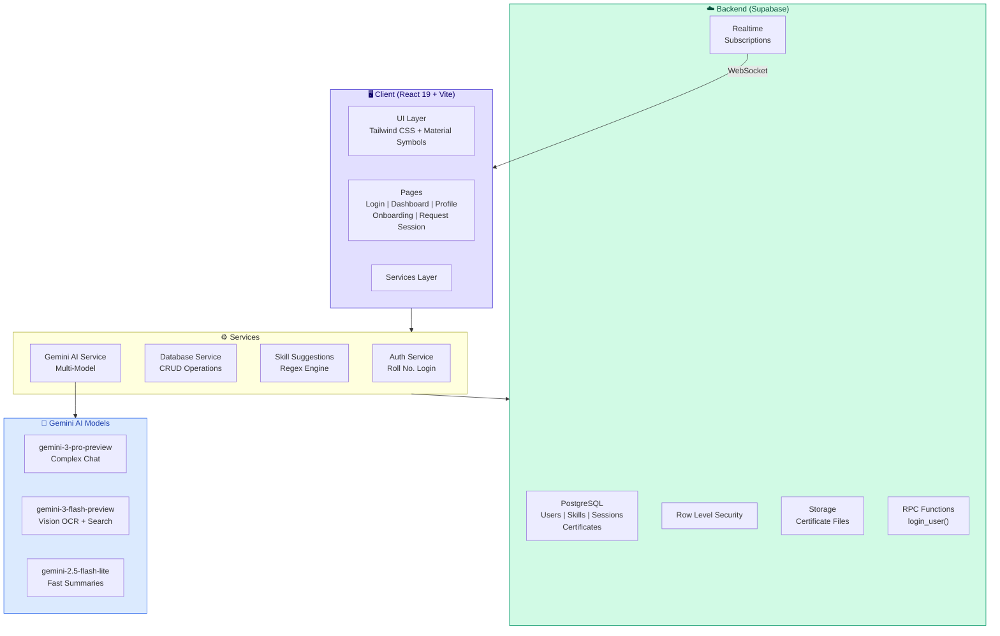
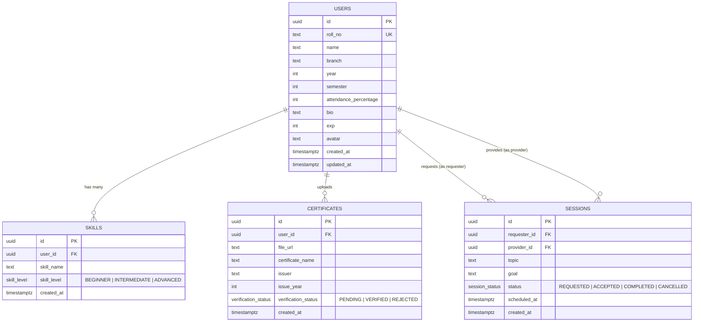
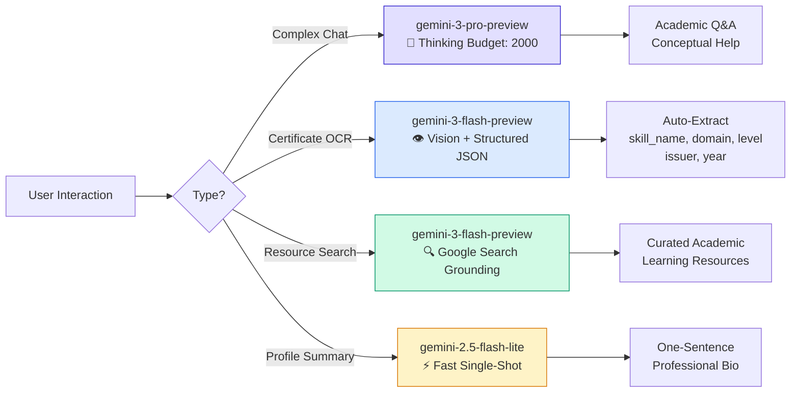
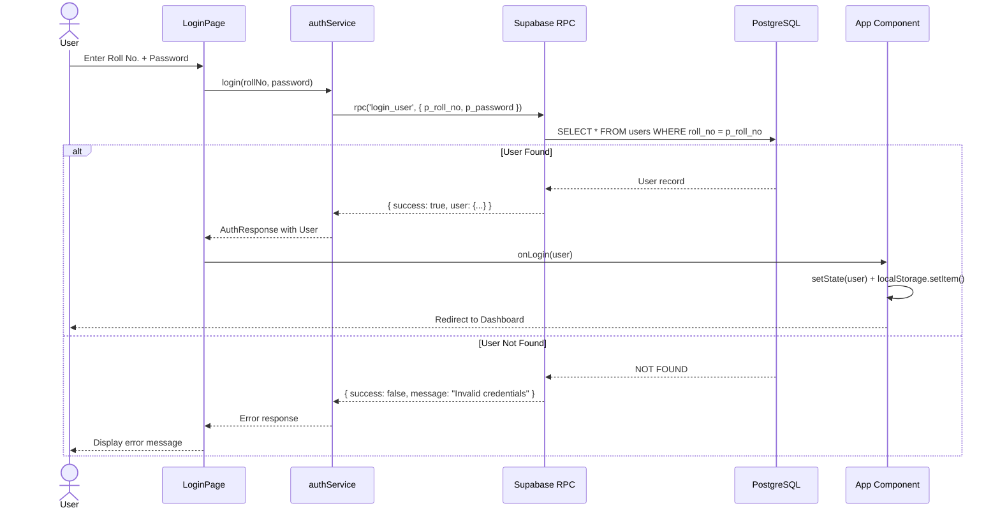
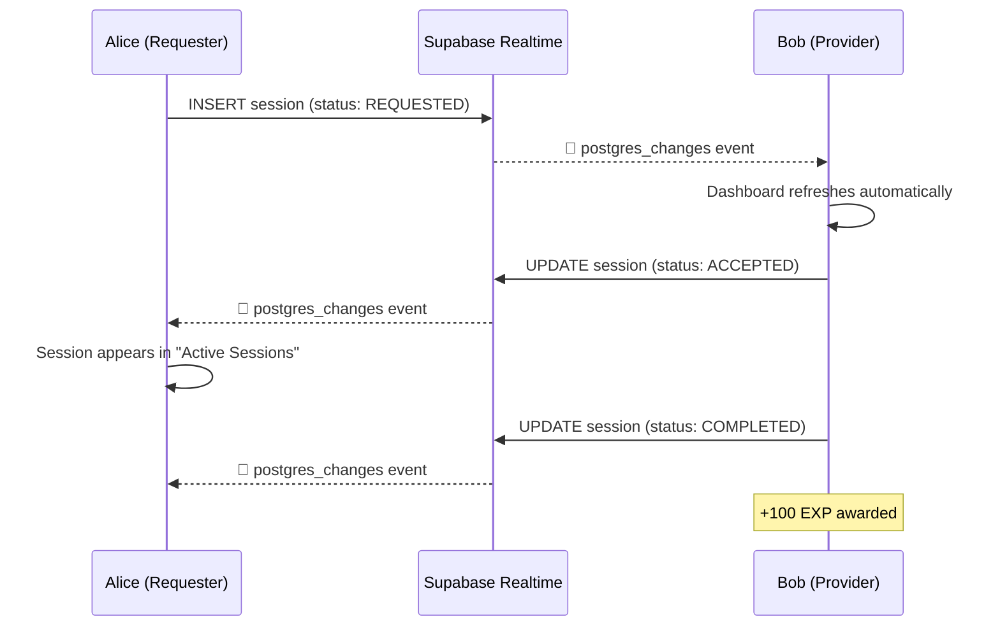

<div align="center">


# 🎓 Campus SkillSwap

### _The Digital Atelier for Campus Minds_

**A peer-to-peer academic knowledge exchange platform where every student can teach AND learn — powered by real-time collaboration, AI-driven insights, and verified expertise.**

[](https://react.dev/)
[](https://www.typescriptlang.org/)
[](https://vitejs.dev/)
[](https://supabase.com/)
[](https://ai.google.dev/)
[](https://tailwindcss.com/)
[](LICENSE)

[**Live Demo**](https://ai.studio/apps/drive/1ru_gOl56NSQarrrlTRVujnuCZWMOOwOi) · [**Report Bug**](../../issues) · [**Request Feature**](../../issues)

---

</div>

## 📋 Table of Contents

- [✨ Overview](#-overview)
- [🏗️ Architecture](#️-architecture)
- [🎯 Key Features](#-key-features)
- [📸 Screenshots](#-screenshots)
- [🧰 Tech Stack](#-tech-stack)
- [🚀 Getting Started](#-getting-started)
- [🗄️ Database Schema](#️-database-schema)
- [🤖 AI Integration](#-ai-integration)
- [📂 Project Structure](#-project-structure)
- [🔐 Authentication Flow](#-authentication-flow)
- [🔄 Real-Time Features](#-real-time-features)
- [🎨 Design System](#-design-system)
- [🛣️ Roadmap](#️-roadmap)
- [🤝 Contributing](#-contributing)
- [📄 License](#-license)
- [🙏 Acknowledgments](#-acknowledgments)

---

## ✨ Overview

**Campus SkillSwap** is a college-internal, peer-to-peer learning platform that fundamentally reimagines how knowledge flows on campus. Unlike traditional mentorship tools with rigid hierarchies, SkillSwap treats **every student as both a learner and a teacher** — because the best way to master something is to teach it.

### 🎯 The Problem

> Students across departments sit in the same campus but rarely collaborate across disciplines. A Computer Science student who's brilliant at React has no easy way to find a Mechanical Engineering student who can teach SolidWorks — and vice versa.

### 💡 The Solution

Campus SkillSwap creates a **bidirectional knowledge marketplace** where:
- A **1st-year student** skilled in Python can teach a **4th-year student** struggling with scripting
- A **Mechanical Engineering** student proficient in SolidWorks can exchange CAD expertise for web development sessions
- **Certificate verification** ensures that expertise claims are backed by real credentials
- An **AI-powered assistant** helps students find resources, explain concepts, and optimize their learning journey

---

## 🏗️ Architecture



---

## 🎯 Key Features

### 🔄 Peer-to-Peer Session Exchange
Request learning sessions with any peer on campus. No hierarchies — anyone can be a provider or requester. Sessions flow through a clean state machine:

```
REQUESTED → ACCEPTED → COMPLETED
              ↘ CANCELLED
```

### 🧠 Intelligent Skill Suggestions
A built-in **regex-based fuzzy search engine** matches against a master list of **100+ academic and professional skills** across 12 categories:

| Category | Examples |
|----------|----------|
| **Programming** | Python, JavaScript, TypeScript, Rust, Go, C++ |
| **Web Development** | React & Next.js, Angular, Vue.js, Node.js & Express |
| **Mobile Development** | React Native, Flutter & Dart, iOS (Swift/SwiftUI) |
| **Data & AI** | Machine Learning, Deep Learning, NLP, Computer Vision |
| **Cloud & DevOps** | AWS, GCP, Docker, Kubernetes, CI/CD Pipelines |
| **Security** | Ethical Hacking, Network Security, Cryptography |
| **Design** | UI/UX Design, Figma & Prototyping, 3D Modeling |
| **Engineering** | SolidWorks, AutoCAD, Embedded Systems, Robotics |
| **Business** | Digital Marketing, Product Management, Financial Modeling |
| **Academics** | Linear Algebra, DSA, Operating Systems, Computer Networks |
| **Soft Skills** | Public Speaking, Technical Writing, Interview Preparation |
| **Emerging Tech** | Blockchain & Web3, IoT, AR/VR, Quantum Computing |

### 📜 Certificate Upload & Verification
Upload course completions, certifications, and awards with a 3-tier verification pipeline:

| Status | Meaning |
|--------|---------|
| ⏳ `PENDING` | Uploaded, awaiting review |
| ✅ `VERIFIED` | Credential confirmed by platform |
| ❌ `REJECTED` | Could not verify authenticity |

Supports **PDF, PNG, and JPG** uploads (max 5MB) with Supabase Storage integration.

### 🤖 AI-Powered Assistant (Gemini)
A floating chat widget powered by **Google Gemini** that acts as your personal academic assistant:
- **Ask anything** — get concise, academic-focused answers
- **Certificate OCR** — automatic skill extraction from uploaded certificates
- **Resource Discovery** — search-grounded academic resource recommendations

### 🏆 Experience Points (EXP) System
Earn **100 EXP** for every completed session. Your EXP score is displayed on your profile, building a reputation that reflects your contribution to the campus learning ecosystem.

### 📡 Real-Time Session Updates
Powered by **Supabase Realtime** via PostgreSQL publications — when someone accepts, cancels, or completes a session, every connected client receives the update **instantly** via WebSocket.

### 📱 Responsive Design
Fully adaptive UI with:
- **Desktop**: Side navigation + multi-column dashboard
- **Tablet**: Collapsed navigation + responsive grid
- **Mobile**: Bottom navigation bar + floating AI chat button

---

## 📸 Screenshots

<div align="center">

### Login Page
> Glassmorphism-inspired split-screen layout with floating decorative elements

### Dashboard — Overview Tab
> Hero section, stat cards, peer discovery grid, and real-time session sidebar

### Skills Management
> Regex-powered search modal with categorized suggestions and proficiency selection

### Certificate Upload
> Drag & drop interface with verification status badges

### Profile Page
> Gradient header, skills grid, certificate timeline, and EXP display

### Mobile View
> Bottom navigation, floating AI chat FAB, and responsive card layout

</div>

---

## 🧰 Tech Stack

### Frontend
| Technology | Version | Purpose |
|------------|---------|---------|
| [React](https://react.dev/) | `19.2.3` | Component-based UI library |
| [TypeScript](https://www.typescriptlang.org/) | `5.8.2` | Static type checking |
| [Vite](https://vitejs.dev/) | `6.2.0` | Lightning-fast HMR & bundling |
| [React Router](https://reactrouter.com/) | `7.11.0` | Hash-based client-side routing |
| [Tailwind CSS](https://tailwindcss.com/) | CDN | Utility-first styling with custom Material Design 3 tokens |

### Backend & Infrastructure
| Technology | Purpose |
|------------|---------|
| [Supabase](https://supabase.com/) | PostgreSQL database, Auth RPC, Realtime, Storage |
| [Google Gemini AI](https://ai.google.dev/) | Multi-model AI (Chat, Vision/OCR, Search Grounding) |

### Design System
| Asset | Source |
|-------|--------|
| **Typography** | [Plus Jakarta Sans](https://fonts.google.com/specimen/Plus+Jakarta+Sans) (Headlines) + [Inter](https://fonts.google.com/specimen/Inter) (Body) |
| **Icons** | [Material Symbols Outlined](https://fonts.google.com/icons) (Variable weight & fill) |
| **Avatars** | [DiceBear Avataaars](https://www.dicebear.com/styles/avataaars/) (Deterministic by roll number) |
| **Color System** | Custom Material Design 3 palette with 40+ semantic tokens |

---

## 🚀 Getting Started

### Prerequisites

| Requirement | Version |
|-------------|---------|
| **Node.js** | `>=18.0` |
| **npm** | `>=9.0` |
| **Gemini API Key** | [Get one here](https://aistudio.google.com/apikey) |

### 1. Clone the repository

```bash
git clone https://github.com/KVenkatesh2006/SkillConnect.git
cd SkillConnect
```

### 2. Install dependencies

```bash
npm install
```

### 3. Configure environment variables

Create or edit the `.env.local` file in the project root:

```env
# Required — Get your key at https://aistudio.google.com/apikey
GEMINI_API_KEY=your_gemini_api_key_here

# Optional — Override default Supabase credentials
VITE_SUPABASE_URL=https://your-project.supabase.co
VITE_SUPABASE_ANON_KEY=your_supabase_anon_key
```

### 4. Start the development server

```bash
npm run dev
```

The app will be available at **[http://localhost:3000](http://localhost:3000)**

### 5. Test login credentials

Use any of the pre-seeded mock accounts:

| Roll Number | Name | Branch | Year |
|-------------|------|--------|------|
| `2023CS101` | Alex Johnson | Computer Science | 2 |
| `2021EE505` | Sam Miller | Electrical Eng. | 4 |
| `2022ME301` | Priya Sharma | Mechanical Eng. | 3 |
| `2024IT102` | Ravi Kumar | Information Tech. | 1 |

> **Note:** Any password works during prototyping — the auth function does not currently validate passwords.

---

## 🗄️ Database Schema

The database runs on **Supabase PostgreSQL** with RLS (Row Level Security) enabled. The complete schema is defined in [`supabase_schema.sql`](./supabase_schema.sql).

### Entity Relationship Diagram



### Custom PostgreSQL Enums

```sql
CREATE TYPE skill_level        AS ENUM ('BEGINNER', 'INTERMEDIATE', 'ADVANCED');
CREATE TYPE session_status     AS ENUM ('REQUESTED', 'ACCEPTED', 'COMPLETED', 'CANCELLED');
CREATE TYPE verification_status AS ENUM ('PENDING', 'VERIFIED', 'REJECTED');
```

### RPC Functions

| Function | Parameters | Returns | Description |
|----------|-----------|---------|-------------|
| `login_user` | `p_roll_no TEXT, p_password TEXT` | `JSON` | Looks up user by roll number, returns user data or error message |

---

## 🤖 AI Integration

Campus SkillSwap leverages **three different Gemini models**, each optimized for a specific use case:

### Multi-Model Strategy



| Model | Use Case | Config Highlights |
|-------|----------|-------------------|
| `gemini-3-pro-preview` | AI Chatbot | `thinkingBudget: 2000`, custom system instruction |
| `gemini-3-flash-preview` | Certificate OCR | Vision input, `responseMimeType: "application/json"`, structured schema |
| `gemini-3-flash-preview` | Academic Resource Search | `tools: [{ googleSearch: {} }]` for grounded responses |
| `gemini-2.5-flash-lite-latest` | Profile Bio Generation | Lightweight, single-shot summarization |

### Certificate OCR Output Schema

```json
{
  "skill_name": "AWS Solutions Architect",
  "domain": "Cloud",
  "level": "ADVANCED",
  "issuer": "Amazon Web Services",
  "year": 2024
}
```

---

## 📂 Project Structure

```
campus-skillswap/
├── 📄 index.html                  # Entry HTML with Tailwind config & Material Design 3 tokens
├── 📄 index.tsx                   # React DOM root mount
├── 📄 App.tsx                     # Root component — routing, auth state, AI chat widget
├── 📄 types.ts                    # TypeScript interfaces (User, Skill, Session, Certificate)
│
├── 📁 pages/
│   ├── 📄 LoginPage.tsx           # Split-screen login with glassmorphism & Google OAuth stub
│   ├── 📄 OnboardingPage.tsx      # 3-step wizard (path → profile → skills)
│   ├── 📄 Dashboard.tsx           # Main hub — overview, skills management, certificates
│   ├── 📄 ProfilePage.tsx         # Public profile with skills, certs, and EXP display
│   └── 📄 RequestSessionPage.tsx  # Session booking form with topic, goal, date/time
│
├── 📁 services/
│   ├── 📄 supabase.ts             # Supabase client initialization
│   ├── 📄 mockDatabase.ts         # Database service layer (auth, CRUD, storage, realtime)
│   ├── 📄 geminiService.ts        # Multi-model Gemini AI integration
│   └── 📄 skillSuggestions.ts     # Regex fuzzy search engine (100+ skills, 12 categories)
│
├── 📄 supabase_schema.sql         # Complete PostgreSQL schema with migrations & seed data
├── 📄 vite.config.ts              # Vite config with env var injection & path aliases
├── 📄 tsconfig.json               # TypeScript config (ES2022, bundler resolution)
├── 📄 package.json                # Dependencies & scripts
├── 📄 metadata.json               # AI Studio app metadata
└── 📄 .env.local                  # Environment variables (GEMINI_API_KEY)
```

---

## 🔐 Authentication Flow



**Session persistence:** Logged-in users are stored in `localStorage` under the key `skillswap_user`, enabling seamless reload without re-authentication.

---

## 🔄 Real-Time Features

The platform uses **Supabase Realtime** to deliver instant updates across all connected clients:



**Implementation:** The sessions table is published via `ALTER PUBLICATION supabase_realtime ADD TABLE sessions`, and the client subscribes through `supabase.channel('public:sessions')`.

---

## 🎨 Design System

### Color Palette

The application uses a **custom Material Design 3** color system with **40+ semantic tokens** configured directly in the Tailwind CDN config:

| Role | Token | Hex | Preview |
|------|-------|-----|---------|
| **Primary** | `primary` | `#3525cd` | 🟪 |
| **Primary Container** | `primary-container` | `#4f46e5` | 🟪 |
| **Secondary** | `secondary` | `#8127cf` | 🟣 |
| **Secondary Container** | `secondary-container` | `#9c48ea` | 🟣 |
| **Tertiary** | `tertiary` | `#7e3000` | 🟠 |
| **Surface** | `surface` | `#f7f9fb` | ⬜ |
| **Error** | `error` | `#ba1a1a` | 🔴 |

### Typography Scale

| Role | Font Family | Usage |
|------|-------------|-------|
| **Headlines** | Plus Jakarta Sans | `h1`–`h6`, brand name, section titles |
| **Body** | Inter | Paragraphs, descriptions, form labels |
| **Labels** | Inter | Buttons, tags, metadata |

### Effects

| Effect | CSS Class | Description |
|--------|-----------|-------------|
| **Glass Navigation** | `.glass-nav` | `rgba(247,249,251,0.8)` + `backdrop-filter: blur(12px)` |
| **Glass Effect** | `.glass-effect` | `rgba(255,255,255,0.8)` + `backdrop-filter: blur(12px)` |
| **Login Gradient** | `.bg-login-gradient` | `linear-gradient(135deg, #3525cd 0%, #4f46e5 100%)` |
| **Custom Scrollbar** | `.custom-scrollbar` | 4px thin scrollbar with `#e2dfff` thumb |

---

## 🛣️ Roadmap

- [x] Peer-to-peer session exchange (no junior/senior hierarchy)
- [x] Regex-based intelligent skill suggestions (100+ skills)
- [x] Certificate upload with verification pipeline
- [x] AI chatbot (Gemini 3 Pro with thinking)
- [x] AI certificate OCR (Gemini Flash Vision)
- [x] AI profile bio generation (Gemini Flash Lite)
- [x] Real-time session updates (Supabase Realtime)
- [x] EXP gamification system
- [x] Responsive design (Desktop, Tablet, Mobile)
- [x] Google OAuth stub
- [ ] Full Google OAuth integration
- [ ] In-app video calling (WebRTC)
- [ ] Session rating & review system
- [ ] Skill endorsements from peers
- [ ] Admin dashboard for certificate verification
- [ ] Push notifications (FCM)
- [ ] Dark mode toggle
- [ ] Leaderboard & achievement badges
- [ ] Group study sessions
- [ ] Calendar integration (Google Calendar)

---

## 🤝 Contributing

Contributions make the open-source community an amazing place to learn, inspire, and create. Any contributions you make are **greatly appreciated**.

1. **Fork** the Project
2. **Create** your Feature Branch
   ```bash
   git checkout -b feature/amazing-feature
   ```
3. **Commit** your Changes
   ```bash
   git commit -m "feat: add amazing feature"
   ```
4. **Push** to the Branch
   ```bash
   git push origin feature/amazing-feature
   ```
5. **Open** a Pull Request

### Commit Convention

This project follows [Conventional Commits](https://www.conventionalcommits.org/):

| Type | Description |
|------|-------------|
| `feat` | New feature |
| `fix` | Bug fix |
| `docs` | Documentation update |
| `style` | Code style (formatting, no logic change) |
| `refactor` | Code restructuring |
| `perf` | Performance improvement |
| `test` | Adding or updating tests |
| `chore` | Maintenance tasks |

---

## 📄 License

Distributed under the **MIT License**. See `LICENSE` for more information.

---

## 🙏 Acknowledgments

- [**Google AI Studio**](https://ai.google.dev/) — for the Gemini API and app hosting
- [**Supabase**](https://supabase.com/) — for the incredible open-source backend-as-a-service
- [**Vite**](https://vitejs.dev/) — for the blazing-fast development experience
- [**Material Symbols**](https://fonts.google.com/icons) — for the variable icon library
- [**DiceBear**](https://www.dicebear.com/) — for deterministic avatar generation
- [**Plus Jakarta Sans**](https://fonts.google.com/specimen/Plus+Jakarta+Sans) & [**Inter**](https://fonts.google.com/specimen/Inter) — for the beautiful typefaces

---

<div align="center">

**Built with ❤️ for campus communities everywhere.**

<br />

_If this project helped you, please consider giving it a ⭐ — it really helps!_

<br />

[⬆ Back to Top](#-campus-skillswap)

</div>
